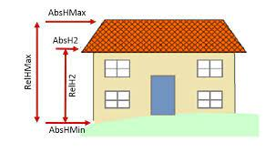

# bedroom-prediction
Modelling to predict number of bedrooms on data from London houses.

### The Task
The task is to develop a model/algorithm which will accurately estimate the number of bedrooms in a property based on its other attributes.  
The file `home_search.data` (see below) contains a sample of residential property data from London.  Each row represents a single property.  The target variable is bedrooms, the other variables are possible predictors.

### Data Fields

1. postcode : Self explanatory
2. bedrooms : Number of bedrooms the property contains. 0 bedrooms denotes a studio flat/bedsit.
3. main_type : HSE = house, FLA = flat
4. second_level_type : DET = detached, SEM = semi-detached, TERR = terraced, BLK = flat in a block of flats, CNV = converted flat
5. footprint_area_sqm : Property footprint is described by the boundaries of the exterior walls of the property.  Footprint area is given in square metres.
6. Height descriptors : Building height, given in square metres. Prefix “absh” indicates height above sea level.  
  
7. internal_floor_area : Property’s internal floor area, given in square metres.
8. chain_1_hash : chain_1_hash groups properties together that belong to the same architectural structure.

### Limitations of current work:
1. Not much analysis of individual variables relationship with target variable. This could highlight some clear non linearities and open the opportunities to use Linear models with spline transformations, or heirarchical modelling on some categorical variables
2. Do not treat high value (more bedroom) houses specially but some weighting based on floor area of postcode could help practically
3. Perhaps a better metric could be chosen as compared to accuracy. Better for multiclass classification like Cohen's Kappa or Matthew's coeff or something that takes into account class imbalance if needed 
4. At the moment all features have been considered but Recursive feature elimination can help reduce noise from the model, there are several correlated features some of which are possibly redundant
5. Did not handle null values gracefully
6. Computationally expensive option (GB) has been chosen

### Future work:
1. Explore random forests in a little more detail since they fit the training data better even on high regularisation so they may be on to some pattern perhaps but they do not handle missing values
2. Use Feature importance and try to link it with subject matter understanding
3. Understand misclassified predictions and see if new features could be engineered or if any issues start popping up i.e. for a particular postcode or particular house type we're under estimating more than others
4. Use subject matter expertise since the nature of problem is more human driven than physics driven. Use heirarchical models and encode some priors around particular house type or postcode. Also have an estimate of uncertainity around predictions to chose a tradeoff of underprediction or over prediction
5. Take a look at literature 
